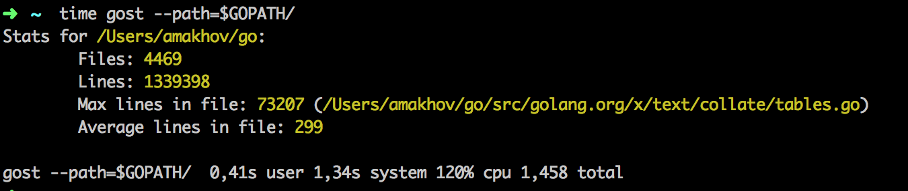

Gost
====

Gost is a simple utility to get info about *.go files in package.



Install
=======

```
go get github.com/makhov/gost
```


Usage
=====

```
gost
```

will prints info about files in current dir in pretty format

```
gost --path=$GOPATH/src/github.com/golang/lint --output=json
```
will prints json with info about files in path 

Usage as library
================
```
import (
    "fmt"
    "github.com/makhov/gost/stats"
)

func main() {
    s := stats.New("$GOPATH/src/")
    fmt.Println(s.Data.TotalFiles)
    
    o := s.NewOutput(stats.OutputJson)
    fmt.Println(o)
}
```


Build from source
==================

```
GO15VENDOREXPERIMENT=1 go build
```